# HR Analytics Dashboard with Employee Attrition Insights

## Project Overview

This project analyzes employee attrition using the IBM HR Analytics Employee Attrition dataset. The goal is to understand which factors most strongly influence employee turnover and to build a data-driven HR decision support workflow using Python-based analysis and visualizations.

The project combines:
- Exploratory Data Analysis (EDA)
- HR-focused business insights
- Data visualizations
- Attrition trend analysis
- Dashboard-ready summaries

---

## Business Problem

Employee attrition can increase hiring cost, reduce team productivity, and affect organizational stability. This project helps HR teams identify patterns such as department-wise attrition, overtime impact, salary differences, and tenure-related turnover risk.

Objectives:
- Measure overall employee attrition
- Compare attrition across departments and job roles
- Examine overtime, salary, and satisfaction patterns
- Identify retention risk areas for HR action

---

## Dataset Information

Dataset: IBM HR Analytics Employee Attrition Dataset

### Summary
- Total Employees: 1470
- Attrition Cases: 237
- Retention Cases: 1233
- Attrition Rate: 16.12%
- Features: 35 total columns
- Missing Values: 0

### Quick Metrics Snapshot

| Metric | Value |
|---|---:|
| Total Employees | 1470 |
| Employees Left | 237 |
| Employees Retained | 1233 |
| Attrition Rate | 16.12% |
| Average Monthly Income (Attriters) | 4787.09 |
| Average Monthly Income (Non-Attriters) | 6832.74 |

---

## Technology Stack

### Programming and Analysis
- Python
- Pandas
- NumPy
- Matplotlib
- Seaborn

### Optional/Project Expansion
- Scikit-Learn
- Power BI

---

## Project Structure

```text
HR_Analytics_Dashboard/
├── dataset/
│   └── HR_Analytics.csv
├── images/
│   ├── department_attrition_rate.png
│   ├── job_role_attrition_rate.png
│   ├── overtime_attrition_rate.png
│   ├── tenure_attrition_rate.png
│   ├── salary_vs_attrition.png
│   └── satisfaction_by_attrition.png
├── notebooks/
│   └── hr_analysis.py
├── hr_analysis.py
├── README.md
├── requirements.txt
├── model/
├── powerbi/
├── sql/
└── venv/
```

---

# Exploratory Data Analysis (EDA)

## 1. Employee Attrition Summary

### Objective
Measure the overall turnover trend in the organization.

### Key Findings
- Total Employees: 1470
- Employees Retained: 1233
- Employees Left: 237
- Attrition Rate: 16.12%

### Business Insight
Approximately 1 in 6 employees leaves the organization. This makes attrition a priority area for HR and management.

### Visualization

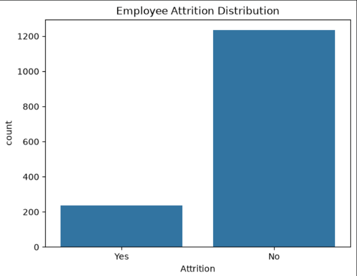

### Business Takeaway
The company's overall turnover is moderate but still high enough to require action. With roughly 1 in 6 employees leaving, the organization should focus on early retention and engagement strategies.

---

## 2. Department-wise Attrition Analysis

### Objective
Identify which departments experience higher attrition.

### Key Findings
- Sales shows the highest attrition rate
- Human Resources also shows a relatively high turnover rate
- Research & Development has the largest employee base, but lower attrition compared to Sales and HR

### Business Insight
Department-specific retention programs should focus on the most affected teams.

### Visualization

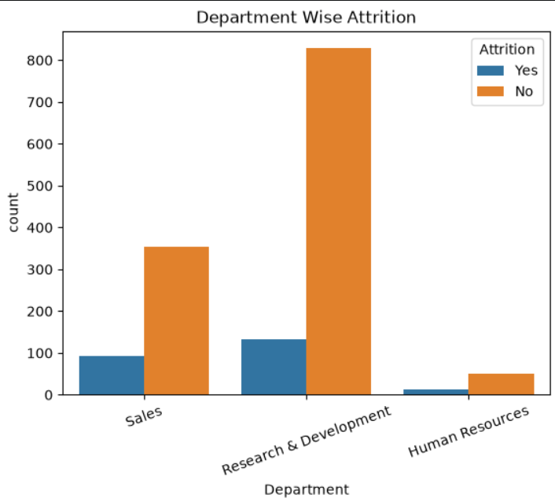

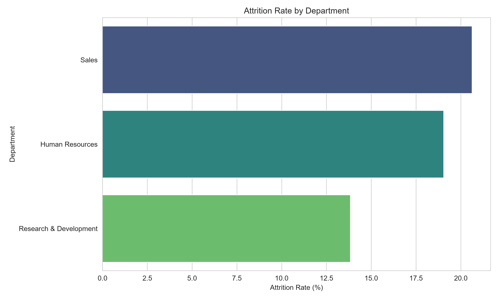

### Business Takeaway
Sales and Human Resources stand out as the most vulnerable teams in terms of attrition, which suggests that department-specific retention programs are more effective than a one-size-fits-all HR approach.

---

## 3. Gender-wise Attrition Analysis

### Objective
Analyze attrition trends across gender groups.

### Business Insight
Understanding gender-based attrition patterns helps organizations build inclusive workplace policies and improve retention strategies.

### Visualization

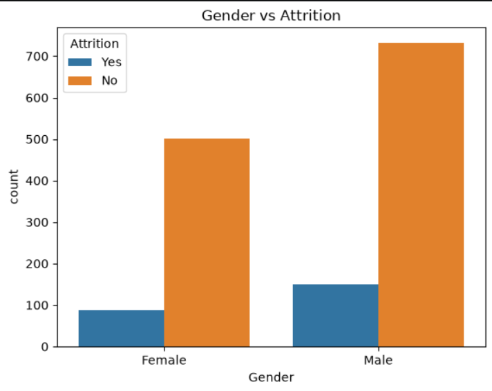

### Business Takeaway
The gender-based trend does not show a drastic imbalance, so attrition risk appears more strongly connected to work conditions, role types, and compensation than to gender alone.

---

## 4. Overtime vs Attrition Analysis

### Objective
Assess whether overtime is linked to attrition.

### Key Findings
- Employees who work overtime have a much higher attrition rate than those who do not
- OverTime is a strong risk factor in the dataset

### Business Insight
Excessive overtime may contribute to stress, burnout, and disengagement, which increases attrition risk.

### Visualization

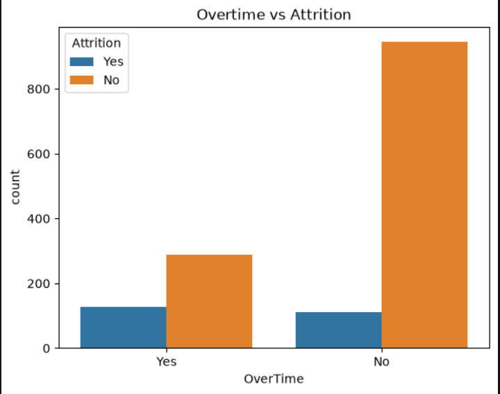

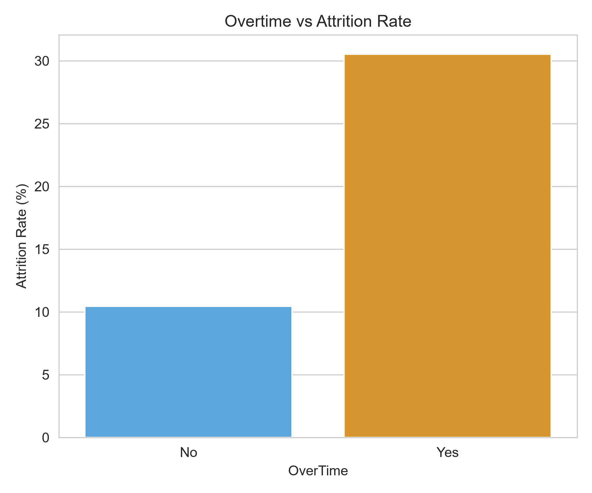

### Business Takeaway
Overtime has a strong association with attrition. This points to burnout and work-life imbalance as important risk factors that HR should address through staffing and workload management.

---

## 5. Monthly Income Distribution

### Objective
Understand how employee compensation is distributed across the workforce.

### Business Insight
Income distribution helps reveal whether pay gaps or lower salary bands are related to attrition risk.

### Visualization

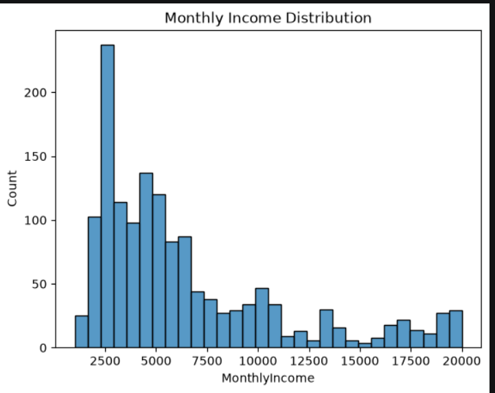

### Business Takeaway
Compensation distribution helps reveal whether employees in lower-paid bands are more likely to leave, suggesting a possible pay-equity or role-value issue worth reviewing.

---

## 6. Salary vs Attrition Analysis

### Objective
Compare monthly income between employees who stayed and those who left.

### Key Findings
- Employees who left earned lower average monthly income than those who stayed
- Compensation may be a retention factor

### Business Insight
Reviewing compensation structures and pay equity can support retention strategies.

### Visualization

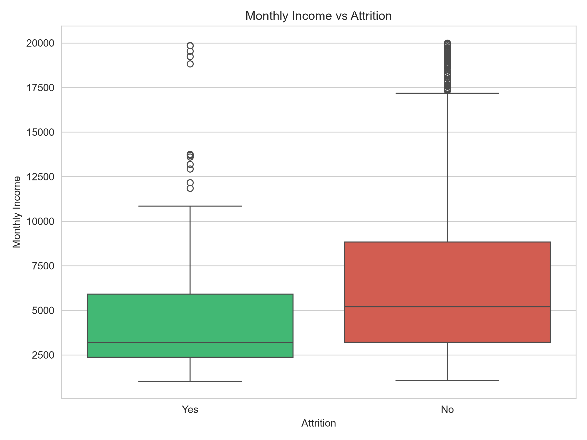

### Business Takeaway
Employees who leave tend to have lower monthly income than those who stay, indicating that compensation is a meaningful factor in retention and should be reviewed regularly.

---

## 7. Job Role vs Attrition Analysis

### Objective
Determine whether certain job roles experience more attrition than others.

### Key Findings
- Sales Representatives show the highest attrition rate
- Laboratory Technicians and Human Resources staff also show elevated turnover
- Manager and Research Director roles show lower attrition

### Business Insight
Career progression, workload, and role-specific retention policies need review in high-risk job roles.

### Visualization

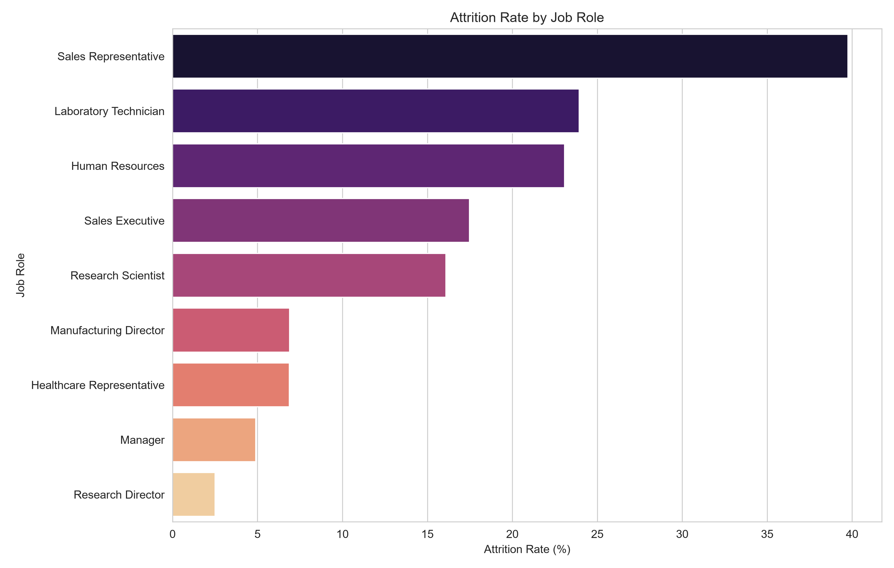

### Business Takeaway
Certain roles, especially Sales Representative and Laboratory Technician positions, appear more vulnerable to turnover. HR should examine workload, advancement opportunities, and role-specific incentives in these functions.

---

## 8. Tenure Analysis

### Objective
Examine how years at the company relate to attrition.

### Key Findings
- Employees in the first 2 years show the highest attrition rate
- Attrition decreases after employees remain longer in the company

### Business Insight
Early employee experience and onboarding quality are critical for retention.

### Visualization

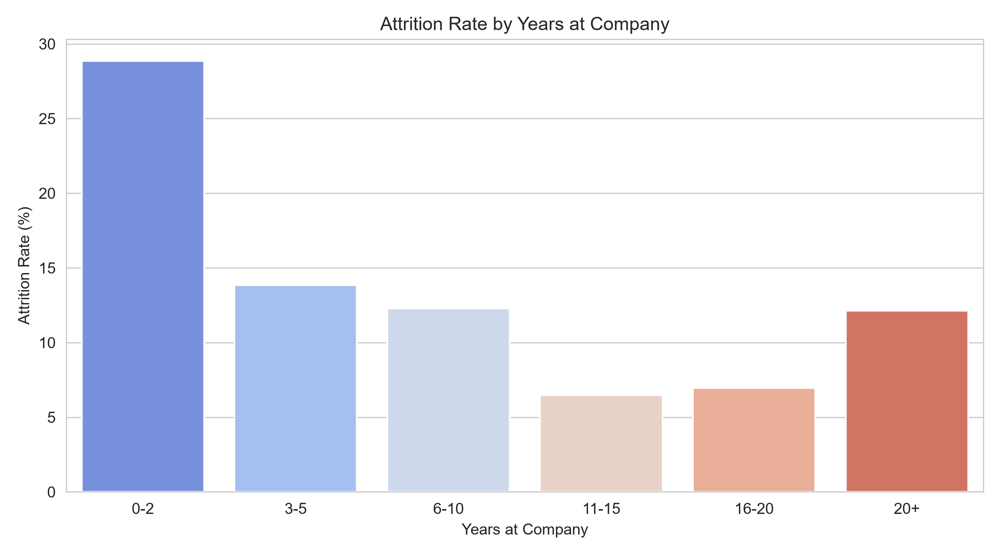

### Business Takeaway
Attrition is highest during the first few years of employment, which indicates that onboarding, mentoring, and early-career engagement play a critical role in retention.

---

## 9. Satisfaction and Work-Life Balance Analysis

### Objective
Compare job satisfaction, environment satisfaction, and work-life balance for staying vs leaving employees.

### Key Findings
- Employees who leave report slightly lower job and environment satisfaction
- Work-life balance is also lower for leavers

### Business Insight
Improving satisfaction and employee experience can strengthen retention.

### Visualization

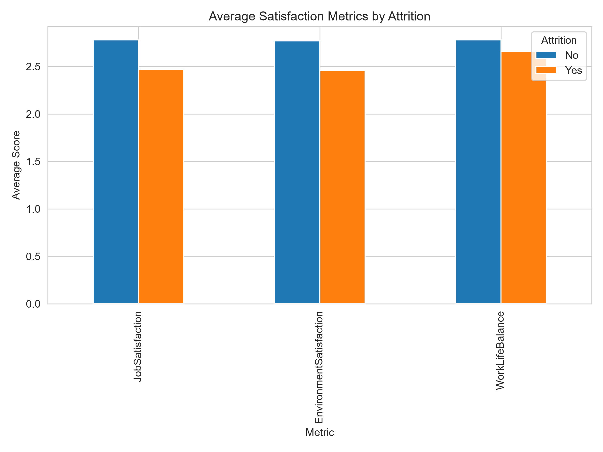

### Business Takeaway
Lower job and environment satisfaction, as well as reduced work-life balance, are associated with attrition. This confirms that employee experience matters as much as compensation in retention strategy.

---

# Key Insights

The current analysis shows that the strongest attrition drivers include:
- Overtime work
- Early tenure / first few years in the company
- Lower salary levels
- Department and role-specific turnover patterns
- Lower satisfaction and work-life balance scores

These findings align with common HR retention concerns and provide a practical starting point for retention planning.

---

# Machine Learning Opportunity

This project is also well-suited for a predictive attrition model. A future enhancement could include:
- Data preprocessing and encoding
- Train/test splitting
- Logistic Regression / Random Forest / XGBoost models
- Evaluation metrics like accuracy, precision, recall, and F1-score
- Feature importance interpretation for HR decision-making

---

# Business Recommendations

- Reduce excessive overtime in high-risk teams
- Strengthen onboarding and early-career engagement programs
- Review compensation for lower-paid employees in high-turnover roles
- Create department-specific retention strategies
- Monitor employee satisfaction and work-life balance regularly
- Focus manager support on early-tenure employees

---

# Conclusion

This project highlights how HR analytics can transform raw employee data into actionable business insights. By identifying the drivers of employee attrition, HR teams can improve retention planning, reduce turnover, and build a more productive workforce.

---

## Author

**Yashika Garg**

B.E. CSE (AI & ML)

Chitkara University

